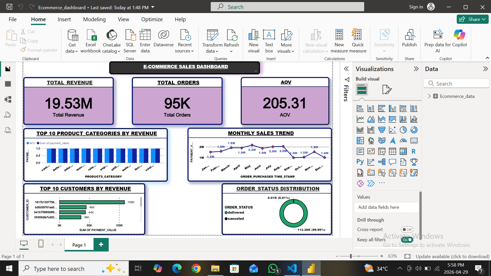

## Dataset:
# Brazilian E-Commerce Sales Analysis – Olist Dataset (Kaggle)

## Tools Used:
- Python (Pandas, NumPy)
- Matplotlib, Seaborn
- Power BI, DAX

## Project Overview:
Analyzed Brazilian e-commerce Olist dataset to extract business insights by performing data cleaning, preprocessing, and exploratory data analysis. Built an interactive Power BI dashboard using 5 core tables for real-time KPI monitoring.

## Key Steps:
- Processed 95.13K delivered order records using Pandas from 5 datasets: orders, customers, order_items, products, payments
- Handled missing values, duplicates, and filtered to delivered orders only
- Performed EDA to identify trends, patterns, and category performance
- Created key metrics: Total Revenue R$ 14.98M, Total Orders 95.13K, AOV R$ 157.42
- Built an interactive Power BI dashboard with year slicer and drill-down filters

## Insights:
- Identified top-performing product category: beleza_saude (Health & Beauty) at R$ 1.4M
- Analyzed monthly sales trends with peak revenue R$ 1.7M in May
- Found top revenue-generating customers with R$ 14K+ individual revenue
- Evaluated order delivery vs cancellation rate for accurate revenue reporting

## Dashboard:

## CONCLUSIONS:

**1. What Was Done**  
- Integrated 5 Olist tables: orders, customers, order_items, products, payments  
- Cleaned data + filtered to delivered orders only

**2. Key Findings**  
- **R$ 14.98M revenue** from **95.13K orders**  
- **AOV: R$ 157.42** | **Peak: R$ 1.7M in May**  
- **Top category: beleza_saude** at R$ 1.4M

**3. Business Value**  
- Cleaned data enables accurate KPI tracking for real business decisions  
- Dashboard-ready dataset supports revenue + category + customer analysis
